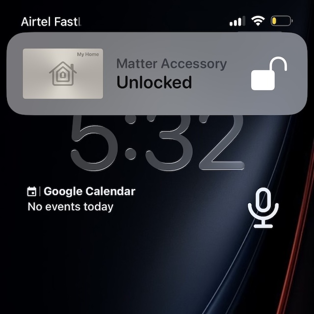
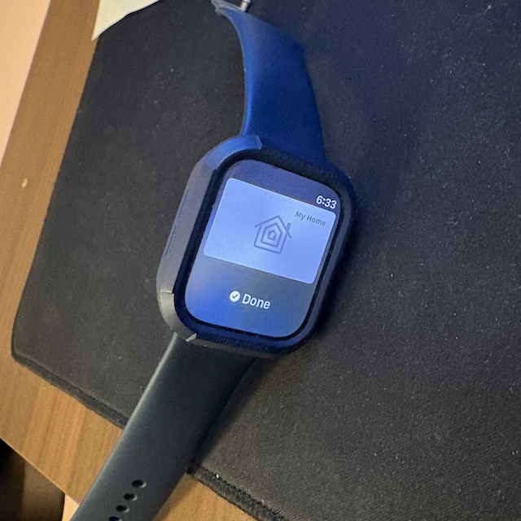
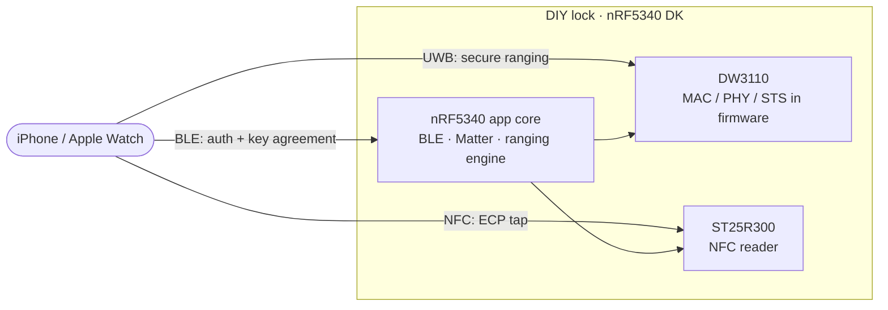

<h1 align="center">openaliro</h1>

<p align="center">
  <b>Walk up and the lock opens. Tap and it opens.</b><br/>
  Secure UWB ranging + NFC for an Aliro digital key, hand-rolled in C on a bare DW3110 — <i>no UWB coprocessor</i>.
</p>

<p align="center">
  
  
  
  
</p>

<p align="center">
  
  &nbsp;&nbsp;&nbsp;&nbsp;
  
</p>

<p align="center"><sub>Real unlocks on hardware: iPhone on approach (left), Apple Watch tap (right).</sub></p>

---

This is the **reader (lock) side** of an [Aliro](https://csa-iot.org/all-solutions/aliro/) digital-key
unlock. An iPhone drives the whole transaction over Bluetooth LE and measures distance over Ultra-Wideband
(UWB); the lock opens when the phone is close and relocks when it walks away. It also opens on an NFC tap.

## Why this is hard

Most UWB projects lean on a turnkey ranging module that hides the radio behind a friendly API. This one
doesn't. It runs on a **bare Qorvo DW3110** (a DWM3000EVB) with **no UWB coprocessor**, so the secure-ranging
stack — the MAC, the PHY framing, and the STS scrambled-timestamp sequence — is rebuilt in firmware on the
nRF5340 app core, straight over the [`deps/dw3000`](deps/dw3000) driver. Getting a phone to trust the distance
it measures means getting all of that byte-for-byte right.

## Quick start

Install the toolchain once per machine:

```bash
nrfutil sdk-manager toolchain install --ncs-version v3.3.0
```

Then build and flash:

```bash
./bootstrap.sh          # fetch NCS v3.3.0 + the Nordic add-on into ./workspace
./build.sh build        # → ./build/merged.hex
./build.sh flash-erase  # first flash of a net-core image
./build.sh flash        # subsequent app-only flash
```

| Command | Does |
|---|---|
| `./build.sh build` | Build to `./build/merged.hex` |
| `./build.sh flash-erase` | First flash of a net-core (HCI) image |
| `./build.sh flash` | Subsequent app-only flash |
| `./build.sh build-flash` | Build, then flash |
| `UWB_SELFTEST=1 ./build.sh build` | One-shot boot self-test, no iPhone |

## Hardware

| Part | Role |
|---|---|
| nRF5340 DK | Host SoC: BLE + Matter and the ranging engine |
| DWM3000EVB (DW3110) | UWB radio on the Arduino header (SPIM4) |
| X-NUCLEO-NFC12A1 (ST25R300) | NFC reader front end for the tap path (SPIM2) |

Pin wiring is in [`integration/overlays/dw3000-nfc.overlay`](integration/overlays/dw3000-nfc.overlay).

## How the unlock works

The transaction runs over BLE; UWB carries no application data, only the distance measurement. Both sides
derive the ranging root key independently from the credential check, so ranging can't be replayed from
captured BLE. The lock opens at close range and relocks beyond a hysteresis margin.



## Status

| Capability | State |
|---|---|
| NFC ECP tap unlock | working |
| BLE auth + key agreement | working |
| On-air ranging setup | working |
| Secure UWB ranging (distance) | working, validated on hardware |
| Distance-gated unlock / relock | working |

The full image builds, links, and fits (app FLASH ≈ 92.9 %, `merged.hex`, exit 0), and approach unlock has
been driven end to end on an nRF5340 DK with a live iPhone.

## Architecture

A layered stack, each layer selectable and depending only on the one below:

- **`modules/woz_uwb/`** — the UWB engine (`src/`, split into `driver/ fira/ ccc/ aliro/ facade/ shell/`):
  the CCC key ladder, MAC, STS, and DS-TWR responder, driving `deps/dw3000` directly. The M1-M4
  ranging-setup codec is in `src/aliro/`; the Nordic add-on calls in through `facade/woz_uwb_facade.c`.
- **`modules/woz_aliro_ecp/`** — NFC ECP emitter for the Express (no-Face-ID) tap.
- **`deps/dw3000/`** — Bruno Randolf's DW3000 decadriver (ISC).

The Nordic add-on owns BLE / Matter and hands the engine a plaintext ranging key; the engine handles UWB
from there. Integration onto the fetched add-on is layered and never edited in place: patches in
`integration/patches/`, config in `integration/overlays/`, modules in `modules/` + `deps/`.

## Credits

- **Nordic Semiconductor** — the nRF Connect SDK and the door-lock add-on this firmware extends.
- **Bruno Randolf** — the ISC-licensed [`dw3000` decadriver](deps/dw3000) that drives the radio.
- **[kormax](https://github.com/kormax/)** — research and ideas on ECP and UWB.
- **[rednblkx](https://github.com/rednblkx/)** — research and ideas on HomeKey.
- **[scottjg](https://github.com/scottjg/)** — help with UWB-based chipset ideas.

## License

Project code (`modules/woz_uwb/`, `modules/woz_aliro_ecp/` except where noted, build scripts, docs) is
ISC — see [`LICENSE`](LICENSE). This is a mixed-license tree, not uniformly ISC:

- [`deps/dw3000/`](deps/dw3000) — Qorvo/Decawave driver under `LicenseRef-QORVO-2` (usable only with a
  Qorvo IC; no reverse engineering).
- `modules/woz_aliro_ecp/src/nfc_prop_ecp.cpp` — `LicenseRef-Nordic-5-Clause` (Nordic Semiconductor).

Per-file `SPDX-License-Identifier` headers are authoritative. Because of the vendor terms above, the
repository as a whole is source-available, not open source in the OSI sense.

---

<p align="center"><sub>
Personal hobby project. Not affiliated with or endorsed by any vendor or standards body.<br/>
Provided as-is, no warranty; do not rely on it to secure anything you care about.
</sub></p>
