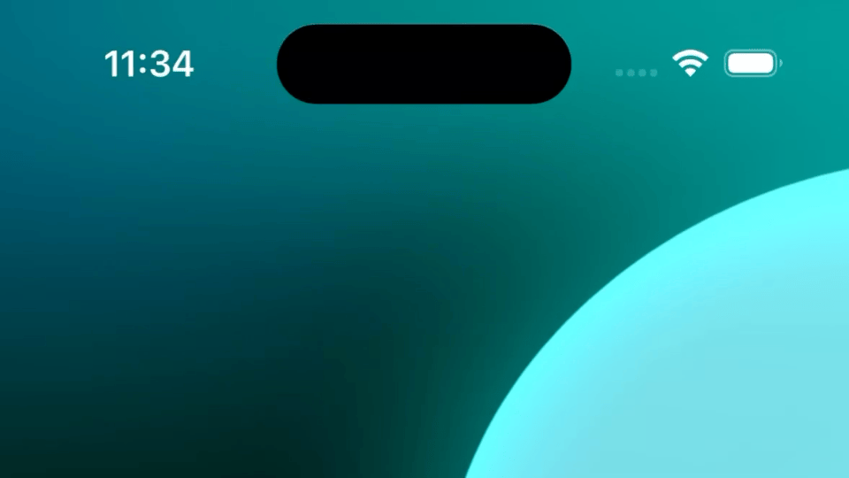
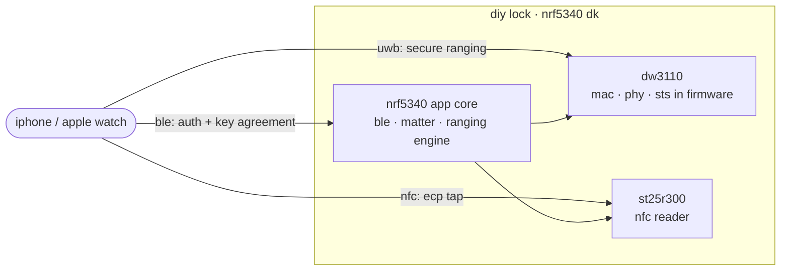

<h1 align="center">openaliro</h1>

<p align="center">
  <b>walk up and the lock opens. tap and it opens.</b><br/>
  an aliro digital key lock that pops your door from your iphone or apple watch:
  by <i>walking up</i> (ultra wideband ranging) and by <i>tapping</i> (nfc).
</p>

<p align="center">
  
  
  
  
</p>

<p align="center">
  
</p>

<p align="center"><sub>real unlock on hardware: iphone on approach.</sub></p>

---

this is the lock side of an [aliro](https://csa-iot.org/all-solutions/aliro/) digital key. your iphone runs
the whole conversation over bluetooth le and measures how far away it is over ultra wideband. walk up and the
door unlocks, walk off and it locks itself again. it also pops open on a plain nfc tap. no app to open, no
button to press.

## what it does

- **hands-free unlock**: the door opens as you walk up and locks again once you leave.
- **tap to unlock**: hold your iphone or watch to the reader (express mode, no face id needed).
- **distance you can trust**: the ranging is tied to your key, so nobody can replay an unlock off a recorded
  signal.
- **no uwb coprocessor**: the whole secure ranging radio stack runs in firmware on a bare qorvo dw3110.

## get started

grab the toolchain once per machine:

```bash
nrfutil sdk-manager toolchain install --ncs-version v3.3.0
```

then fetch the sdk, build, and flash:

```bash
make bootstrap     # fetch ncs v3.3.0 + the nordic add-on into ./workspace
make build         # → ./build/merged.hex
make flash-erase   # first flash of a net-core image
make flash         # every flash after that
```

<sub>the first flash needs <code>flash-erase</code>. after that, plain <code>flash</code> is enough. run <code>make</code> on its own for the full, grouped list.</sub>

everything you can run:

| command | does |
|---|---|
| `make` | grouped list of every target |
| `make bootstrap` | fetch ncs v3.3.0 + add-on (~6.5 gb), apply patches |
| `make build` | incremental build to `./build/merged.hex` |
| `make rebuild` | force a clean pristine build |
| `make flash-erase` | first flash of a net-core (hci) image |
| `make flash` | every flash after the first |
| `make build flash` | build, then flash |
| `make selftest` | one-shot boot self-test, no iphone |
| `make test` | host test suite for the ccc core (no toolchain or hardware) |
| `make coverage` | line coverage of the ccc core, plus html report |
| `make clean` | remove `./build` |

build options pass through as make variables: `make build PRETTY=1 CHIP=dw3720` (chip defaults to dw3000; also `PRISTINE=1`, `SELFTEST=1`). the `./bootstrap.sh` and `./build.sh` scripts still work directly if you prefer.

## what you need

| part | role |
|---|---|
| nRF5340 DK | the brains: ble + matter and the ranging engine |
| DWM3000EVB (DW3110) | the uwb radio, on the arduino header (spim4) |
| X-NUCLEO-NFC12A1 (ST25R300) | the nfc reader front end for tap (spim2) |

pin wiring lives in [`integration/overlays/dw3000-nfc.overlay`](integration/overlays/dw3000-nfc.overlay).

## how it works

the whole transaction rides on ble; uwb carries zero application data, just the distance. both sides derive
the ranging key on their own from the auth, so ranging can't be replayed off sniffed ble. the door opens up
close and relocks past a little hysteresis margin.



## status

| capability | state |
|---|---|
| nfc ecp tap unlock | working |
| ble auth + key agreement | working |
| on-air ranging setup | working |
| secure uwb ranging (distance) | working, validated on hardware |
| distance-gated unlock / relock | working |

the full image builds, links, and fits (app flash ≈ 92.9%, `merged.hex`, exit 0), and approach unlock has
been driven end to end on an nrf5340 dk with a live iphone.

<details>
<summary><b>under the hood</b> (why this is hard, and how it's built)</summary>

### the hard part

most uwb projects lean on a turnkey ranging module that hides the radio behind a friendly api. this one
doesn't. it runs on a bare qorvo dw3110 (a dwm3000evb) with no uwb coprocessor, so the whole secure ranging
stack, the mac, the phy framing, and the sts scrambled timestamp sequence, all get rebuilt in firmware on the
nrf5340 app core, straight over the [`deps/dw3000`](deps/dw3000) driver. getting a phone to trust the distance
it measures means getting every byte of that right.

### architecture

a layered stack, each layer optional and leaning only on the one below it:

- **`modules/woz_uwb/`**: the uwb engine (`src/`, split into `driver/ fira/ ccc/ aliro/ facade/ shell/`):
  the ccc key ladder, mac, sts, and ds-twr responder, driving `deps/dw3000` directly. the m1-m4 ranging-setup
  codec is in `src/aliro/`, and the nordic add-on calls in through `facade/woz_uwb_facade.c`.
- **`modules/woz_aliro_ecp/`**: nfc ecp emitter for the express (no-face-id) tap.
- **`deps/dw3000/`**: bruno randolf's dw3000 decadriver (isc).

the nordic add-on owns ble / matter and hands the engine a plaintext ranging key; the engine takes uwb from
there. integration onto the fetched add-on is layered and never edited in place: patches in
`integration/patches/`, config in `integration/overlays/`, modules in `modules/` + `deps/`.

</details>

## credits

- **nordic semiconductor** for the nrf connect sdk and the door-lock add-on this firmware extends.
- **bruno randolf** for the isc-licensed [`dw3000` decadriver](deps/dw3000) that drives the radio.
- [@kormax](https://github.com/kormax/) for ideas on ecp and uwb.
- [@rednblkx](https://github.com/rednblkx/) for ideas on homekey.
- [@scottjg](https://github.com/scottjg/) for helping with uwb based chipset ideas.

## license

the project's own code (`modules/woz_uwb/`, `modules/woz_aliro_ecp/` bar the exceptions below, build scripts,
docs) is isc, see [`LICENSE`](LICENSE). it's a mixed license tree though, not uniformly isc:

- [`deps/dw3000/`](deps/dw3000) is the qorvo/decawave driver under `LicenseRef-QORVO-2` (only usable with a
  qorvo ic, no reverse engineering).
- `modules/woz_aliro_ecp/src/nfc_prop_ecp.cpp` is `LicenseRef-Nordic-5-Clause` (nordic semiconductor).

the per-file `SPDX-License-Identifier` headers are the source of truth. because of those vendor terms, the
repo as a whole is source-available, not open source in the osi sense.

---

<p align="center"><sub>
personal hobby project. not affiliated with or endorsed by any vendor or standards body.<br/>
provided as-is, no warranty, don't lean on it to secure anything you actually care about.
</sub></p>
